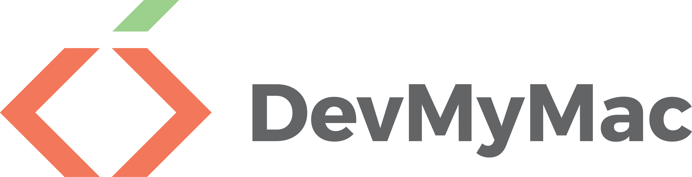

[](https://gitter.im/DevMyMac/Lobby?utm_source=badge&utm_medium=badge&utm_campaign=pr-badge&utm_content=badge)

#### Welcome To DevMyMac!
DevMyMac is a script that allows the user to setup their OSX / MacOS Computer for Development in

* Ruby
* Java
* Android Development
* Unity3D
* Python
* Javascript
* PHP

See [Below](#guide) For whats installed!

Works with __OSX Yosemite__, __OSX El Capitan__ & __MacOS Sierra__

# Using the Script
To use this script, first you must install XCode, or the XCode Command Line Tools. To install the command line tools, use the command:

`xcode-select --install`

Then you can use the script!

`sh -c "$(curl -fsSL https://raw.githubusercontent.com/adamisntdead/DevMyMac/master/setup.sh)"`

<hr/>

<a name="guide"></a>
# Whats Installed

* [Core](#core)
* [Node](#node)
* [Java](#java)
* [Android](#android)
* [Ruby](#ruby)
* [Unity3D](#unity)
* [Databases](#database)

<a name="core"></a>
### Core
###### Set Computer Name
The first thing the script does when you run it, is you are prompted for the name of your computer.
Then, we take the name and use it to set the __hostname and computer name__.

```bash
sudo scutil --set ComputerName "$cpname"
sudo scutil --set HostName "$cpname"
sudo scutil --set LocalHostName "$cpname"
defaults write /Library/Preferences/SystemConfiguration/com.apple.smb.server NetBIOSName -string "$cpname"
```

###### Settings Changes
After this we make a few changes to the settings:

* __Enable Press and hold keys__
`defaults write -g ApplePressAndHoldEnabled -bool false`
* __Show Path in the Finder__
`defaults write com.apple.finder ShowPathbar -bool true`
* __Speed Up Key Press Repeat__
`defaults write NSGlobalDomain KeyRepeat -int 0.02`
* __Speed Up Time Taken to Start Key Repeats__
`defaults write NSGlobalDomain InitialKeyRepeat -int 12`
* __Show The Library Folder__
`chflags nohidden ~/Library`

###### Git Configuration
You will be prompted for your name and Git E-Mail. This is to set the git configuration values.

```bash
git config --global user.email "adam@adamkellydesign.com"
git config --global user.name "Adam Kelly"
```

###### Zsh
Next, the script will install [OhMyZsh](https://github.com/robbyrussell/oh-my-zsh), which isa really nice configuration pack for Zsh, which is the shell of choice for many, including myself. We don't need to install zsh, as its already installed on OSX.

###### Homebrew
Homebrew is a package manager for OSX / MacOS, thats quite popular. Its buit on Ruby, and is really simple to use. It is what we will use to install most of the software and packages in the script.

You install it using the command:

`/usr/bin/ruby -e "$(curl -fsSL https://raw.githubusercontent.com/Homebrew/install/master/install)"`

###### Options
You will now be prompted for a few options on what you would like to install, see the individual sections on each one for a full explenation

###### Packages and Software
One of the main parts of this script is the ease of installing the Packages / Apps you use quickly.
To do this, we are going to use Homebrew, and a Homebrew _tap_ called __Cask__.

To install cask, we use this command:

`brew tap caskroom/cask`

Now we can use 2 commands to install apps and packages.

To install a homebrew package normally, we use the command `brew install package-name`, and to install an app using Cask, we use `brew cask install app-name`.

As part of this script we install these packages:
* Tree
* wGet
* ACK
* Heroku-Toolbelt

Using this command:
```
brew install \
  tree \
  wget \
  ack \
  heroku-toolbelt
```
And install these apps:
* Google Chrome
* Coderunner 2
* Evernote
* Firefox
* Spotify
* Gitter
* Github Desktop
* Atom
* GitKraken
* Open Broadcast Software (_OBS_)
* Steam
* Mamp
* MacDown
* Google Drive
* iTerm 2
* Sublime Text
* Virtualbox
* Minecraft
* Scratch

Using this command:
```
brew cask install \
  google-chrome \
  coderunner \
  evernote \
  firefox \
  spotify \
  gitter \
  github-desktop \
  atom \
  gitkraken \
  obs \
  steam \
  mamp \
  macdown \
  google-drive \
  iterm2 \
  sublime-text \
  virtualbox \
  minecraft \
  scratch
```

Finally, we install EMacs
```
brew install emacs --with-cocoa
brew linkapps emacs
```

### Node
<a name="node"></a>
Instead of installing [Nodejs](nodejs.org) via Homebrew, we can install it via Node Version Manager, This gives us more control over what versions we are using, which is handy when testing our code for backwards compatibility.
We install NVM with this command: `curl -o- https://raw.githubusercontent.com/creationix/nvm/v0.31.4/install.sh | bash`

Then we can use NVM to install the latest version of Node, and then tell NVM to use that version.
```bash
nvm install node
nvm use node
```

Now we have access to the Node command, and also [NPM](npmjs.com) (Node Package Manager).
The script also installs some modules for convenience (Bower, Gulp, Grunt-CLI, Coffeescript, JSHint and LESS)


### Java
<a name="java"></a>
To setup for java development, we want to install the [JDK](http://www.oracle.com/technetwork/java/javase/downloads/jdk8-downloads-2133151.html) (Java Development Kit), along with my IDE of choice, eclipse.

Thankfully, we can install all of these using Homebrew:
```bash
brew cask install \
  java \
  eclipse-ide \
  eclipse-java
```


### Android Development
<a name="android"></a>
To develop for android devices, we need a few things, The JDK, Android Studio, The Android SDK and Possibly an IDE (Eclipse)

Again, we can do all of this with Homebrew. First we install the JDK as its a dependency for others, then the IDE's and finally the Android SDK:

```bash
brew cask install \
  java \
  eclipse-ide \
  eclipse-java \
  android-studio \
  intellij-idea-ce

brew install android-sdk
```


### Ruby
<a name="ruby"></a>
Like with node, the best wasy to install ruby is by using the [Ruby Version Manager](https://rvm.io/). This means we can easily control what version of ruby we are using, which again is helpful for backwards checking ect.

First, we must setup something to get a key, so that the installation doesnt fail.
```
brew install gpg
command curl -sSL https://rvm.io/mpapis.asc | gpg --import -
```

then we can run the RVM install script

```
\curl -L https://get.rvm.io | bash -s stable
source ~/.rvm/scripts/rvm
```

And then finally we can install the latest version of ruby:
```
rvm install ruby-2.3.1
```

Now we have Ruby and Ruby Gems installed, we can install rails
```
gem install bundler
gem install rails
```


### Unity3D
<a name="unity"></a>
This bit is quite simple, to install [Unity3D]() We can just use the cask for both _Unity_ and the _Unity Web Player_
The command is the same as the installation of the core apps:
```bash
brew cask install unity unity-web-player
```


### Databases
<a name="database"></a>
In this option, we install a few types of database, which is very useful for PHP, Ruby and Node Apps.
We are going to install a few common ones:
* MySQL (with MySQL Workbench)
* Postgresql
* MongoDB
* Redis
* Elastic Search

We can install all of these using homebrew, and we can install MySQL Workbench Using Cask

```
brew install \
  mysql \
  postgresql \
  mongodb \
  redis \
  elasticsearch

brew cask install mysqlworkbench
```
